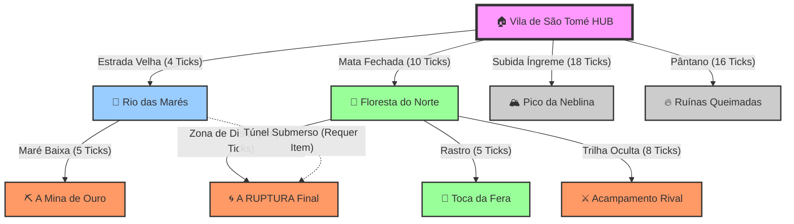

# 🗺️ Atlas do Eco: A Mata Costeira (Ato 1)

> *"A terra aqui não é muda. O chão lembra de quem pisou nele. O rio sabe quem se afogou. Navegar pela Mata Costeira não é apenas ler um mapa, é ler os humores de um organismo vivo."*
> — Diário de um Cartógrafo Desaparecido

Este livro detalha a geografia, as distâncias, os perigos ambientais e a estrutura de conexões da região do Ato 1. Ele serve como referência absoluta para o Mestre (Narrativa) e para o Motor do Jogo (Cálculo de Ticks e Pathfinding).

---

## 1. O Mapa de Conexões (Topologia)

A região opera em um sistema de **Nós e Caminhos**. Embora a movimentação futura seja livre (Grid), a lógica de conexão segue este diagrama de fluxo.

---

## 2. Regras de Terreno e Biomas

Cada zona possui modificadores globais que afetam tanto a **Exploração** (Custo de Ticks) quanto o **Combate** (Buffs/Debuffs).

### 🏠 Zona Central: Vila de São Tomé
O último bastião de "normalidade".
* **Tipo de Terreno:** Urbano / Seguro.
* **Custo de Movimento:** 1 Tick (Normal).
* **Regra de Descanso:** Descanso Longo aqui custa apenas 2 Ticks (bônus de conforto) e recupera 100% de Vida/Recursos.
* **Serviços:**
    * *Ferreiro:* Repara itens e vende armas básicas.
    * *Taverna:* Hub de "Fofoca" (Info sobre NPCs).
    * *Capela:* Remove maldições leves (Custo em Ouro).

### 🌲 Zona Norte: Floresta do Norte
Uma mata densa, antiga e vibrante, onde a luz do sol mal toca o chão.
* **Tipo de Terreno:** Mata Densa.
* **Custo de Movimento:** 2 Ticks (Difícil).
* **Regra de Combate (Cobertura Natural):** Todos os personagens (aliados e inimigos) ganham +1 de Defesa contra ataques à distância se estiverem a mais de 5 metros do atacante.
* **Variável de Save (Procedural):**
    * A localização exata da *Toca da Fera* varia (Norte, Nordeste ou Noroeste da zona).

### 🌊 Zona Leste: Rio das Marés
Um rio largo que sofre influência de marés sobrenaturais, subindo e descendo erraticamente.
* **Tipo de Terreno:** Água / Lama.
* **Custo de Movimento:** 1 Tick (Margem) / Impossível (Água Alta).
* **Mecânica da Maré:**
    * **Ticks 0-40 (Manhã):** Maré Alta. Acesso à Mina bloqueado.
    * **Ticks 41-80 (Tarde):** Maré Baixa. Acesso liberado.
    * **Ticks 81+ (Noite):** Maré Alta e Corrompida (Dano de 1 PV por tick se entrar na água).

### 🏔️ Zona Oeste: Pico da Neblina
Uma montanha sagrada envolta em nuvens que sussurram.
* **Tipo de Terreno:** Montanha / Vertical.
* **Custo de Movimento:** 3 Ticks (Subida) / 1 Tick (Descida).
* **Regra de Exaustão:** A cada 20 Ticks passados aqui, o jogador deve fazer um teste de Vigor (CD 12) ou ganha 1 nível de Fadiga (–1 em todas as rolagens).
* **Regra de Combate (Ventos):** Ataques à distância têm Desvantagem. Empurrões jogam o alvo 2 metros a mais.

### 🔥 Zona Sul: Ruínas Queimadas
O local de um massacre antigo. O chão é cinza e o ar cheira a fumaça eterna.
* **Tipo de Terreno:** Terra Arrasada / Pântano.
* **Custo de Movimento:** 2 Ticks.
* **Regra de Terror:** Inimigos aqui são do tipo *Espiritual*. Personagens com Sanidade/Moral baixa sofrem alucinações (Textos falsos na interface ou sons de passos inexistentes).

---

## 3. A Rota dos Rivais (Os Bandeirantes)

A facção "Bandeirantes de Sangue" não espera pelo jogador. Eles têm uma rota fixa programada no Atlas.

* **Ponto de Partida:** Acampamento Secreto (Zona Norte).
* **Objetivo:** Chegar à Ruptura (Epicentro).
* **Velocidade:** Eles movem 1 Bloco a cada **15 Ticks Globais**.
* **Checkpoints (Momentos de Tensão):**
    1.  **Tick 100:** Eles dominam a entrada da Floresta Norte. (Jogadores agora encontram patrulhas hostis lá).
    2.  **Tick 250:** Eles estabelecem um posto avançado na "Fronteira da Distorção".
    3.  **Tick 400:** Eles iniciam o ritual de abertura forçada na Ruptura. (O Boss começa a ficar "Ascendido").

> **Sabotagem:** Se o jogador usar a ação de "Sabotagem Física" no Atlas (ex: derrubar árvore na trilha), o contador de velocidade deles sobe para **1 Bloco a cada 25 Ticks**.

---

## 4. Distribuição de Recursos (Loot Table Regional)

Para garantir que o "Completionista" tenha motivos para visitar tudo, os recursos são segregados por zona.

| Recurso | Onde Encontrar (Principal) | Uso Principal |
| :--- | :--- | :--- |
| **Madeira de Ferro** | Floresta do Norte | Crafting de Armas e Escudos Leves |
| **Erva-Lua** | Rio das Marés (Noite) | Poções de Mana e Rituais |
| **Minério de Sangue** | Pico da Neblina (Cavernas) | Melhoria de Armas (Dano +1) |
| **Cinzas Espirituais** | Ruínas Queimadas | Itens Mágicos e Proteção contra Maldição |
| **Comida/Suprimentos** | Vila (Compra) ou Rio (Pesca) | Recuperação de PV em descanso |

---

## 5. Variáveis Procedurais (O "Tempero" do Save)

Embora o mapa seja fixo (A Vila é sempre no centro), o conteúdo dos nós varia a cada Save Game (`Seed`).

| Elemento | Variação Possível |
| :--- | :--- |
| **Baús de Tesouro** | Existem 10 locais possíveis para baús no mapa. Apenas 5 spawnarão no Save atual. |
| **Inimigos Especiais** | O "Lobo Alfa" pode estar na Floresta ou rondando o sopé do Pico. O jogador precisa rastrear. |
| **Rotina do Pajé** | *Save A:* Medita na Cachoeira (Manhã). *Save B:* Medita na Caverna (Manhã). |
| **Clima Inicial** | Pode começar com "Chuva" (Dificulta fogo, facilita furtividade) ou "Seca" (Risco de incêndio, movimento melhor). |